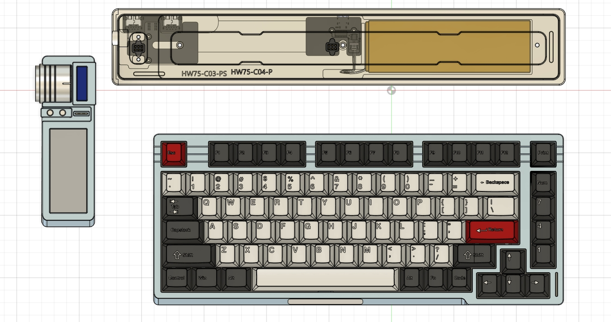
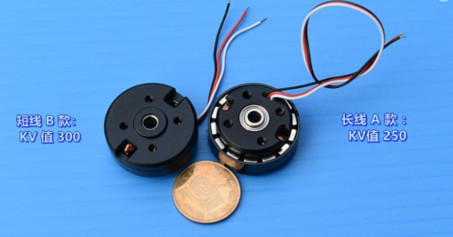
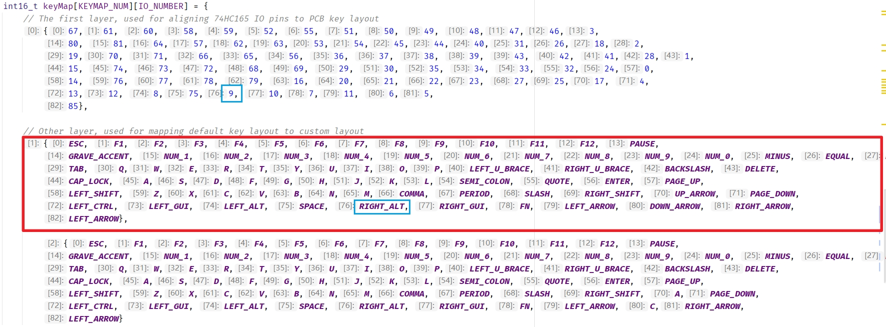

# 【瀚文】HelloWord-Smart Keyboard


> `瀚文` 智能键盘是一把我为自己使用需求设计的 **多功能**、**模块化** 机械键盘。
>
> 键盘使用模块化设计，左侧的**多功能场景交互模块**可以替换成各种自定义组件，默认使用的是一个带电子墨水屏以及FOC力反馈旋钮的`Dynamic组件`；键盘使用我自己开发的基于ARM Cortex-M芯片的键盘固件以及模块固件；键盘本体使用移位寄存器方式实现优化的按键扫描电路；模块以及键盘本体可以单独使用，也可以通过串口协议进行相互通信和调用。
>
> **本仓库开源的资料内容包括：**
>
> * 瀚文本体硬件设计的10块PCB设计源文件，提供立创EDA专业版的文件格式
> * 外壳设计结构文件
> * 键盘本体的固件源码（已相对完善）
> * Dynamic组件的固件源码（已完成框架，更多APP扩展WIP）
> * 键盘二次开发SDK（开发中）
>
> **键盘功能演示可以参考：**
>
> * [【自制】我做了一把 模 块 化 机 械 键 盘 !【软核】_哔哩哔哩_bilibili](https://www.bilibili.com/video/BV19V4y1J7Hx)
>
> * [I Made A Customized Modular Keyboard ! - YouTube](https://www.youtube.com/watch?v=mGShD9ZER1c)

**注意：Issues里面是讨论项目开发相关话题的，不要在里面发无意义的消息，不然watch了仓库的人都会收到通知邮件会给别人造成困扰的！！！灌水可以在仓库的Discuss里讨论！**

---

## 1. 项目说明

### 1.0 更新说明：

**22.8.20更新：**

* PCB工程更新，见仓库的工程链接，所有元器件能在立创直接下单的都改成了对应的封装，方便大家配置BOM.

**22.8.13更新：**

* 新打样的PCB已经收到，但是由于何同学这周发视频，为了避免带来不必要的压力，所以决定错峰下周六再把PCB工程更新（doge）.

**22.7.31更新：**

* 添加键盘硬件所有设计原理图文件（电路还有些bug没修复，如视频里的飞线，会晚些等新版PCB打样收到验证没问题后更新）
* 添加键盘固件源代码
* 添加Dynamic组件源代码

### 1.1 项目文件说明：

#### 1.1.1 Hardware

Hardware文件夹内是瀚文键盘里面用到的所有电路的原理图和PCB文件，目前提供的是[立创EDA专业版](https://oshwhub.com/pengzhihui/b11afae464c54a3e8d0f77e1f92dc7b7)格式的源文件以及Gerber格式的光绘文件用于提供给厂家进行直接加工。


一共有如下几块板子：

- **HelloWord-Keyboard**：主键盘的PCB，控制器为STM32F103，可以配合底座单独使用，提供常规按键输入功能，带全按键独立RGB灯。
- **HelloWord-Ctrl**：左侧Dynamic组件的PCB，控制器为STM32F405，可以配合底座单独使用，提供FOC力反馈旋钮、电子墨水屏显示、OLED显示、RGB灯等功能。
- **HelloWord-Connector**：主键盘用于连接底座的触点PCB，通过FFC排线与键盘PCB连接。
- **HelloWord-Connector-Ctrl**：Dynamic组件用于连接底座的触点PCB，通过FFC排线与Dynamic组件PCB连接。
- **HelloWord-Encoder**：磁编码器PCB，用于对无刷电机进行位置反馈，需要配合一个径向充磁的永磁铁工作。
- **HelloWord-Hub1**：底座上扩展出的两个额外USB-A接口转接PCB，通过FFC排线和TypeC接口板连接。
- **HelloWord-Hub2**：底座上扩展出的两个额外USB-A接口的母座PCB，预留的是USB3.0母座和引脚，但是目前只使用到了2.0接口，未来可以升级到USB3.0的HUB。
- **HelloWord-TypeC**：底座上用于连接电脑的TypeC接口PCB，板载了电源充电管理芯片，以及USB-HUB芯片，通过FFC排线连接其余模块。
- **HelloWord-OLED**：Dynamic组件上OLED屏幕的最小驱动电路以及转接板。
- **HelloWord-TouchBar**：可选的电容触摸条模块PCB，使用6按键电容触摸芯片组成一个线性感应阵列，通过FFC排线和主键盘PCB连接。

#### 1.1.2 Firmware

Firmware中提供了上面所有板子的固件源码，以及**预编译好的bin固件**可以直接烧录，主要包含以下两个工程：

* **HelloWord-Keyboard-fw**：主键盘的固件，主要实现了基于硬件SPI和移位寄存器的高速按键扫描、基于硬件SPI&DMA的总线式RGB灯控制、HID高速设备键盘枚举&报文协议实现、非易失存储配置、多层按键映射等功能。
* **HelloWord-Dynamic-fw：**Dynamic组件的固件，主要实现了基于FOC的电机控制代码、可配置触感封装类、电子墨水屏驱动、OLED驱动、USB全速复合设备枚举和通信协议、RGB灯控制等功能。

工程都是基于STM32HAL实现的，所以提供了对应的`.ioc`文件，可以自行用STM32CubeMX打开，生成对应的keil或者STM32IDE工程文件。当让也可以像我一样，用CLion或者STM32CubeIDE进行编译和下载。

`_Release`文件夹里是预编译好的bin文件，可以用**ST-Link Utillity**或者STM32CubeProgrammer之类的软件直接下载到芯片。

关于固件的实现细节后文有讲解。

> 把CLion变成STM32的IDE的方法参考我之前发的一篇教程：[配置CLion用于STM32开发【优雅の嵌入式开发】](https://zhuanlan.zhihu.com/p/145801160) 。

#### 1.1.3 Software

Software中提供了一些用于和键盘交互的电脑端上位机软件，包括视频里演示的傻瓜化修改墨水屏图片的上位机软件，以及后续会逐步补充用于**修改键位的图形化软件**给**模块添加APP**的应用商店软件，这些还在开发中。

#### 1.1.4 Tools

Tools主要是提供一些三方的工具软件，比如**STM32 ST-LINK Utility** 、用于安装驱动的**zadig**等等。

#### 1.1.5 3D Model

文件夹里是键盘用到的所有结构件的3D模型文件，可以用于3D打印。

#### 1.1.6 Docs

相关的参考文件，包括芯片的Datasheet等。

## 2. 硬件架构说明

**关于结构设计？**

瀚文的结构包括三大部分：**扩展坞底座**、**键盘输入模块**和**可替换的多功能交互模块**，键盘输入模块和可替换的多功能交互模块通过若干接触式触点连接在所述扩展坞底座顶部：



而键盘本体也是一个标准的客制化键盘层叠结构设计，包含减震棉、PCBA、定位板、轴下垫等：


键盘的结构设计主要是Xikii根据S98修改而来，为75键布局，有其他布局需要的同学可以自行修改PCB和固件适配。

> 关于视频中展示的结构件，由于是Xikii的方案所以我也不好擅自把源文件放出，而且原始版本结构是用于CNC机加工的，成本会比较高。
>
> 所以我也让Xikii帮忙设计一套简化版可用于3D的结构件，并开源出来放到仓库。

**关于芯片选型？**

- 键盘主控选用的芯片是STM32F103CBT6，实际上C8T6也可以，不过考虑到未来固件功能的扩展性，Flash大一倍的CBT6性价比更高。这块由于我固件基本都是使用HAL库实现的，因此实际上也可以把主控替换成STM32系列的任何一款芯片，需要支芯片有2个SPI硬件接口分别用于按键扫描以及RGB灯驱动，以及一个全速USB接口即可。
- Dynamic组件主控的STM32F4，这个是因为我手边这款芯片比较多，理论上可以替换为性价比更高的F1系列的，只要芯片具备一个高级定时器用于PWM生成、2个硬件SPI接口用于编码器和电子墨水屏通信、一个I2C接口用于OLED驱动，以及一个全速USB接口即可。
- 电机的磁编码器芯片我是使用AS5047P，也是一款很常用性能很好的磁编码芯片，不过成本略高，我只是因为手边有所以选了这款，也是可以修改为其他更便宜的型号的比如MT6816等，当然也需要修改固件驱动代码。
- 按键扫描用的移位寄存器使用的74HC165，国产芯片零售的话大概0.5元一片，一片可以驱动8个按键，按照你自己需要的按键数目修改串联的寄存器芯片即可。进口的165比如TI原装的要比国产贵一些，性能也会稍微好点，不过由于本项目中按键扫描频率4MHz已经完全够用了，因此哪怕国产的16MHz芯片也绰绰有余了。
- 电容触摸板使用的是一个6通道电容触摸按键芯片XW06A实现的，这个对于PCB感应盘的设计有一定要求，仓库已经提供了设计好的PCB。对于该芯片的读取方式，其实和普通按键没有区别，所以本方案中也是使用74HC165进行扫描读取的。
- 电机FOC驱动电路完全是从我的Ctrl驱动器中移植过来的，使用FD8288Q作为栅极驱动器，无需电流传感器。

**关于烧录方式？**

使用JLink、STLink之类的调试器烧录，我在PCB和外壳上都预留了SWD调试口。对于没有硬件开发经验的同学，我晚点也会放出一个Bootloader，可以直接通过USB口进行固件升级。

**关于电机选型？**

我使用的是一个2204的二手电机，不过这一款电机目前好像不太好买，大家可以选取类似尺寸的无刷电机替换，参数方面需要KV值低一些，最好200左右。电机需要手动在转子上安装一个径向充磁的永磁体用于编码器定位，不同型号的电机需要对FOC参数进行一些调整。



## 3. 软件架构说明

**关于键盘固件的按键映射方式？**

为了充分发挥视频中提到的移位寄存器扫描方案的优势，固件代码中将PCB Layout走线和按键扫描顺序解耦，通过软件进行重映射。也就是说PCB中按键的连接可以是任意的，走完线之后可以在`hw_keyboard.h`文件中的`keyMap[KEYMAP_NUM][IO_NUMBER]`中指定映射方式。

> 这是一个二维数组，代表有`KEYMAP_NUM`层键位映射，每一层有`IO_NUMBER`个按键（也就是你的键盘按键数目）；其中第0层是特殊的，负责映射PCB按键的随机布局到键盘标准按键布局，后续的1、2、3、4...层都是自定义的，负责映射标准按键布局到任意布局。

**举个例子：**

考虑原理图中箭头指的那个按键，这个按键可以在PCB的任意位置，但是我们可以看到，它是从左到右（按74HC165的连接顺序，也即移位扫描顺序）的第10颗，因此它的编号为9（从0开始算）.


如果我们在实际的PCB板上把它放在了**右边Alt**的位置，那么参考在下图代码**红色框**中的第1层映射（也就是标准布局）中的`RIGHT_ALT`的序号是76，那么在第0层映射的76号变量就填入9（蓝色框）.

这样依次把你PCB上所有按键都填入0层映射，就得到了一个映射好的标准键盘了。后续2、3、4、5...层需要怎么映射就随意修改添加即可，也不需要再使用数字编号，而是可以直接用枚举的按键名称很方便。

> 所以对于想修改键盘配列的人，只需要再原理图上添加或删减几个串联的74HC165，然后PCB随意走线，再将代码中0层映射删减或增加一些数字即可（比如在下面的例子中我的键盘是83键的）；后面几层的修改就以此类推了。

代码中通过`keyboard.Remap`函数来映射不同层，比如`keyboard.Remap(2)`这一句是使用第2层映射。



**关于键盘固件的滤波方法？**

固件中使用了每个按键独立的滤波，但是是以一种非常高效的方式来实现的（毕竟1KHz的报文，每个报文期间至少扫描两次按键，意味着每秒钟需要进行 **1000\*2\*[按键数目]** 次数的滤波）。

基本原理很简单，就是按键抖动的原因是按下后会在高低电平之间反复横跳，这个稳定时间一般是几十us（注意是电平稳定时间，不是按键触发时间，后者是由于按键簧片接触时间的不确定性导致的，可能长达数ms）。

在QMK的[qmk_firmware/feature_debounce_type](https://github.com/qmk/qmk_firmware/blob/master/docs/feature_debounce_type.md)文档中描述了其使用的几种滤波方法，分为Eager和Defer、对称和非对称等，

默认是使用**对称延迟全局滤波**，也就是说是对所有按键进行同等的滤波，等所有的按键都稳定了不再变化，再提交扫描数据。

> 与之对应的是激进滤波方法，也就是说一旦检测到按键变化就提交数据，但是在这之后的N毫秒时间内不再响应任何按键（也就避免了把不断抖动的按键提交上去）。这种方法触发延迟低，但是对噪声很敏感，容易误触发。

我在瀚文的固件中使用的是**对称延迟独立滤波**，也就是对每个按键进行两次检测，如果第一次检测到了按键变化，那么相隔N微秒（这个参数可以配置，大于按键典型抖动时间即可）再检测一次，如果两次检测结果一致，那么判断按键被按下，此时可以确保按键发生了变化，且不会重复触发按键，兼顾延迟和稳定性。

这个过程是通过异或运算进行高效处理的，正好按键buffer由于是移位寄存器扫描得到的，本身就是每一位代表一个按键，所以滤波效率非常高，实测效果也挺好的。


**关于键盘固件的HID描述符？**

这个可以直接参考源码的`usbd_customhid.c`文件，我配置了两个ReportID，ID-0是上报键位扫描数据的（全键无冲），ID-1是预留用于后续跟上位机改键软件通信用的。

**关于RGB的控制？**

代码中使用的是单总线的ws2812b系列灯珠，一根线就可以串联一大堆RGB，而且代码中实现了SPI-DMA模拟时序，得到了超高的刷新率。

目前代码里只写了一个demo灯效（非常简单就是轮询色彩），自己添加额外的灯效的话，通过`keyboard.SetRgbBuffer`函数设置RGB值，然后`SyncLights`把数据发送给LED即可：

```
while (true)
    {
        /*---- This is a demo RGB effect ----*/
        static uint32_t t = 1;
        static bool fadeDir = true;

        fadeDir ? t++ : t--;
        if (t > 250) fadeDir = false;
        else if (t < 1) fadeDir = true;

        for (uint8_t i = 0; i < HWKeyboard::LED_NUMBER; i++)
            keyboard.SetRgbBuffer(i, HWKeyboard::Color_t{(uint8_t) t, 50, 0});
        /*-----------------------------------*/

        // Send RGB buffers to LEDs
        keyboard.SyncLights();
    }
```


## 4. SDK设计 & 二次开发

待补充。


> 感谢以下项目：
>
> [Lexikos/AutoHotkey_L: AutoHotkey - macro-creation and automation-oriented scripting utility for Windows. (github.com)](https://github.com/Lexikos/AutoHotkey_L)
>
> [olikraus/u8g2: U8glib library for monochrome displays, version 2 (github.com)](https://github.com/olikraus/u8g2)
>
> [simplefoc/Arduino FOC for BLDC  (github.com)](https://github.com/simplefoc/Arduino-FOC)
>
> [zhongyang219/TrafficMonitor: 这是一个用于显示当前网速、CPU及内存利用率的桌面悬浮窗软件，并支持任务栏显示，支持更换皮肤。 (github.com)](https://github.com/zhongyang219/TrafficMonitor)

